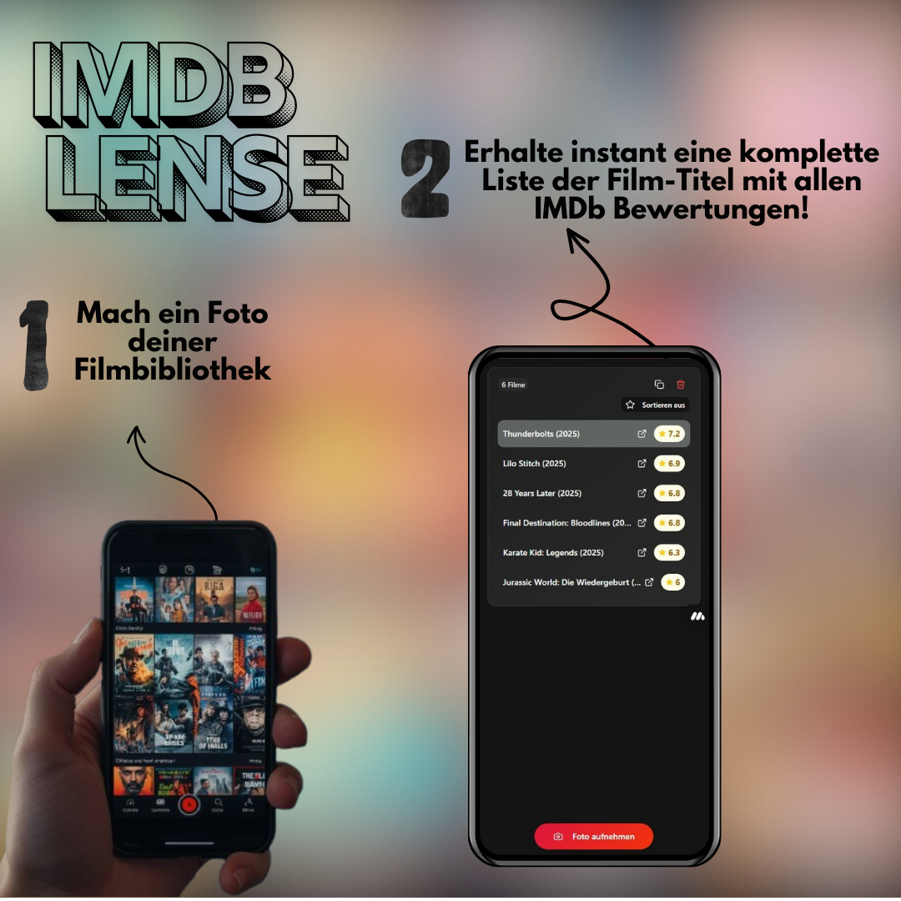

# 🎬 Imdb Lense - Movie Title Recognition App

**IMDB Lense** ist eine Web App (PWA & Native Android), die Filmtitel von Netflix und anderen Streaming-Plattformen mittels KI-gestützter Texterkennung erkennt und mit IMDb-Daten anreichert. Das System verwendet Google Gemini AI für hochpräzise OCR-Erkennung und bietet eine vollständige Integration mit TMDB und OMDb APIs.



[](https://reactjs.org/)
[](https://www.typescriptlang.org/)
[](https://vitejs.dev/)
[](https://capacitorjs.com/)
[](https://ai.google.dev/)

## ✨ Features

### 🎯 Kernfunktionalität
- **KI-gestützte OCR**: Hochpräzise und sehr schnelle Texterkennung mittels Google Gemini 2.5 Flash Lite
- **Native Kamera-Integration**: Volle Unterstützung für Android Kamera-Funktionen (Zoom, Fokus) via Capacitor
- **IMDb-Rating Integration**: Vollständige OMDb API Integration mit Ratings & Votes
- **Direkte IMDb-Links**: Ein-Klick Navigation zu IMDb-Seiten
- **Intelligente Sortierung**: Nach Titel, Rating oder IMDb-Verfügbarkeit

### 🎨 Benutzeroberfläche
- **Einheitliche Ansicht**: Alle Informationen (Titel, IMDb-ID, Rating) kombiniert
- **Copy-Funktionen**: Einzeln oder alle Daten kopieren
- **Skeleton Loading**: Bessere wahrgenommene Performance
- **Responsive Design**: Optimiert für Mobile & Desktop

### 🔧 Technische Features
- **Zentralisierter Service-Layer**: Orchestrierte API-Aufrufe für maximale Effizienz
- **Performance-optimiert**: React.memo, useCallback, useMemo für optimale Re-renders
- **Batch-Verarbeitung**: Effiziente API-Nutzung mit Rate-Limiting
- **Error Recovery**: Robuste Fehlerbehandlung und Fallbacks
- **Advanced Caching**: React Query mit intelligenten Stale-Times

## 🚀 Technologie-Stack

### Frontend & Mobile
- **React 18**
- **TypeScript**
- **Vite**
- **Tailwind CSS**
- **shadcn/ui**
- **Capacitor (Android)**
- **@capacitor-community/camera-preview** (Native Kamera-Vorschau)

### KI & ML
- **Gemini 2.5 Flash Lite** für optimale Performance und Genauigkeit
- **Intelligente Textverarbeitung** mit Umlaut-Erkennung und Bereinigung

### APIs & Daten
- **TMDB API** für Filmdaten und IMDb-ID Matching
- **OMDb API** für IMDb-Ratings und Statistiken
- **React Query** für effizientes API-State-Management

## 🏗️ Architektur

### Projektstruktur
Die Architektur folgt einem modularen Ansatz mit strikter Trennung von UI, Business-Logik und API-Kommunikation.

```
src/
├── components/          # UI-Komponenten
│   ├── ui/             # shadcn/ui Basis-Komponenten
│   ├── CameraCapture.tsx    # Native Kamera-Logik & Bildverarbeitung
│   ├── MovieTitlesList.tsx  # Darstellung & Filterung der Ergebnisse
│   └── LoadingScreen.tsx    # Initialisierungs-Screen
├── hooks/              # Utility Hooks
│   ├── use-mobile.tsx  # Mobile Detection
│   └── use-toast.ts    # Toast Notifications
├── services/           # API-Clients & Business Logic
│   ├── movieService.ts # Orchestrator: Verbindet TMDB & OMDb
│   ├── tmdbService.ts  # TMDB API Client (Low-Level)
│   ├── omdbService.ts  # OMDb API Client (Low-Level)
│   └── ocrService.ts   # Google Gemini OCR Service
├── types/              # TypeScript Type Definitions
│   ├── tmdb.ts         # TMDB API Types
│   └── omdb.ts         # OMDb API Types
├── lib/                # Utilities & Constants
└── pages/              # Route-Komponenten
    └── Index.tsx       # Haupt-Container (verbindet Components)
```

### Datenfluss & Service Orchestration

Der `movieService` fungiert als zentrale Schnittstelle und orchestriert die Datenanreicherung:

```mermaid
flowchart TD
    %% User Layer
    subgraph "👤 User Interface"
        A[📱 App Container]
        B[📷 CameraCapture]
        C[🎨 MovieTitlesList]
    end
    
    %% Service Layer
    subgraph "⚙️ Service Layer"
        D[🤖 OCR Service]
        E[⚡ Movie Service (Orchestrator)]
        F[🎬 TMDB Service]
        G[⭐ OMDb Service]
    end
    
    %% External APIs
    subgraph "☁️ External APIs"
        H[Google Gemini AI]
        I[TMDB API]
        J[OMDb API]
    end
    
    %% Flow
    A --> B
    B -- "1. Bild" --> D
    D -- "2. API Call" --> H
    H -- "3. Rohtext" --> D
    D -- "4. Extrahierte Titel" --> A
    
    A --> C
    C -- "5. fetchMovieData(Titel)" --> E
    
    E -- "6. Suche Film" --> F
    F --> I
    I --> F
    
    E -- "7. Hole Rating (mit IMDb ID)" --> G
    G --> J
    J --> G
    
    E -- "8. Komplettes Movie Objekt" --> C
```

1. **OCR Pipeline (`ocrService`)**:
   Bild → Google Gemini AI → Rohtext → Textbereinigung → Titel-Liste

2. **Data Enrichment (`movieService`)**:
   Der `movieService` übernimmt die intelligente Verknüpfung:
   - Empfängt Titel vom UI
   - Fragt `tmdbService` nach Metadaten & IMDb-ID
   - Wenn IMDb-ID vorhanden: Fragt `omdbService` nach Ratings
   - Gibt ein konsolidiertes Objekt zurück

3. **UI Rendering**:
   React Query cacht die Ergebnisse des `movieService` und versorgt die UI mit Daten.

## 📱 Verwendung (Android Native)

Um die volle Funktionalität inkl. Zoom und Fokus zu nutzen, muss die App als native Android-App gebaut und auf einem Gerät installiert werden.

### Build & Deploy Workflow

1. **Web-Build erstellen**:
   ```bash
   npm run build
   ```

2. **Android-Projekt synchronisieren**:
   ```bash
   npx cap sync
   ```

3. **In Android Studio öffnen**:
   ```bash
   npx cap open android
   ```
   *Falls dieser Befehl fehlschlägt (Pfad nicht gefunden), öffne Android Studio manuell und wähle den `android` Ordner im Projekt aus.*

4. **App starten**:
   - Schließe dein Android-Gerät per USB an (USB-Debugging aktivieren!)
   - Klicke in Android Studio auf den grünen **Play-Button (▶)**

### Wichtige Hinweise zur Kamera
- Die App nutzt `@capacitor-community/camera-preview` für eine native Live-Vorschau.
- Die Vorschau läuft **hinter** der Web-Oberfläche (`toBack: true`).
- Der Hintergrund der App wird transparent geschaltet, wenn die Kamera aktiv ist.
- **Funktioniert nicht im Browser!** Muss auf einem echten Gerät getestet werden.

## 🔧 API-Konfiguration

API-Keys werden über Environment Variables konfiguriert:
```env
VITE_TMDB_API_KEY=your_tmdb_key
VITE_OMDB_API_KEY=your_omdb_key
VITE_GEMINI_API_KEY=your_gemini_key
```
